# Astro QR — Custom QR Generator

A small, polished web app that turns any URL into a custom QR code with an artistic or astronomy-themed silhouette. Two render styles ship out of the box — **Composite** (qart.js-style, default) and **Halftone** (Chu et al. 2013). Built for [NTU Astronomical Society](https://www.instagram.com/ntu_astro/).

**Live:** [custom-qr.ntuas.com](https://custom-qr.ntuas.com)

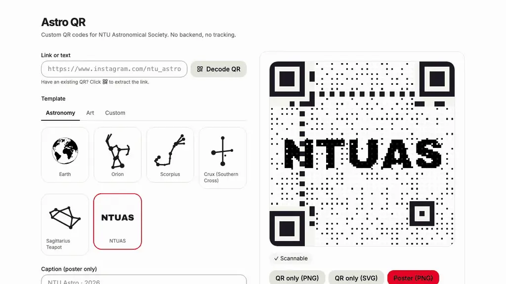

---

## Contents

- [What it makes](#what-it-makes) — the gallery
- [Two render styles](#two-render-styles) — Composite vs Halftone
- [How it works](#how-it-works) — pipeline diagram
- [Try it locally](#try-it-locally)
- [CI & Deploy](#ci--deploy)
- [Project layout](#project-layout)
- [Architecture & references](#architecture--references)

## What it makes

**21 built-in templates across two tabs**, plus your own PNG/SVG upload. Each cell below is a real export of the same URL — keeps the comparison honest and shows scan-verified results across silhouette densities and palettes.

### Astronomy (6)

Pure-black silhouettes; default to **mono** color mode (template's accent colour drives the QR ink).

<table>
  <tr>
    <td align="center"><br/><sub>Earth</sub></td>
    <td align="center">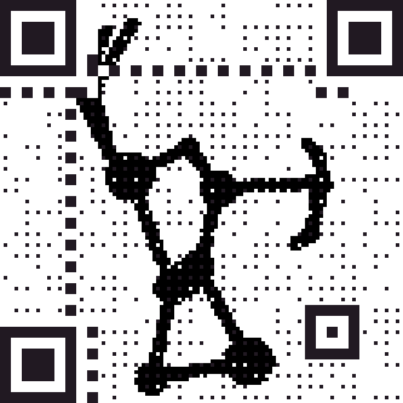<br/><sub>Orion</sub></td>
    <td align="center">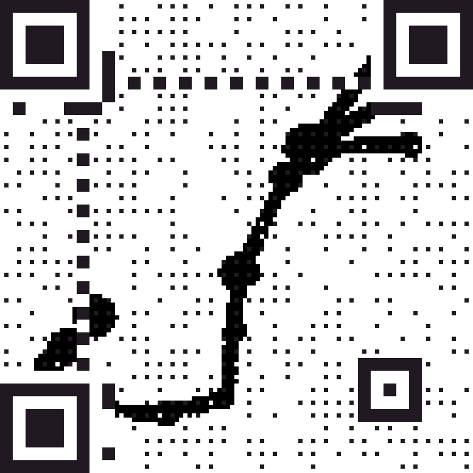<br/><sub>Scorpius</sub></td>
  </tr>
  <tr>
    <td align="center">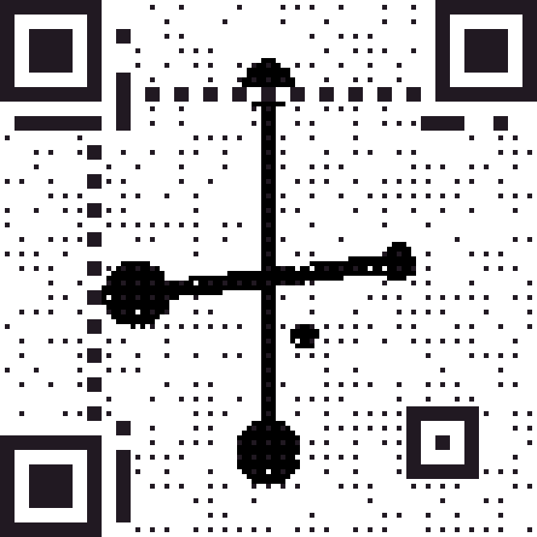<br/><sub>Crux (Southern Cross)</sub></td>
    <td align="center">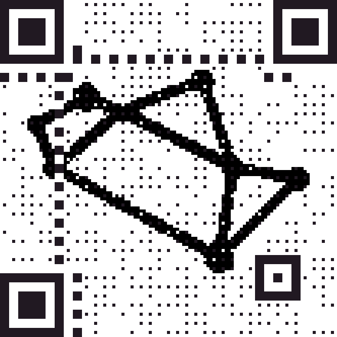<br/><sub>Sagittarius Teapot</sub></td>
    <td align="center">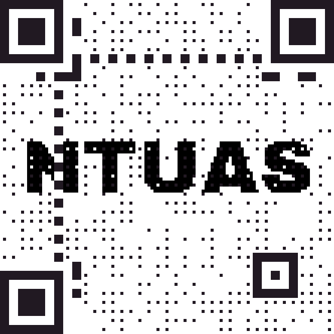<br/><sub>NTUAS</sub></td>
  </tr>
</table>

### Art (15 public-domain paintings)

Full-colour source images; default to **color** mode (per-pixel hue preserved, contrast-clamped). Six highlights below; the rest are tucked under the dropdown.

<table>
  <tr>
    <td align="center">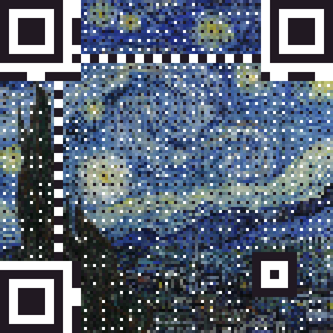<br/><sub>The Starry Night<br/><i>Van Gogh</i></sub></td>
    <td align="center">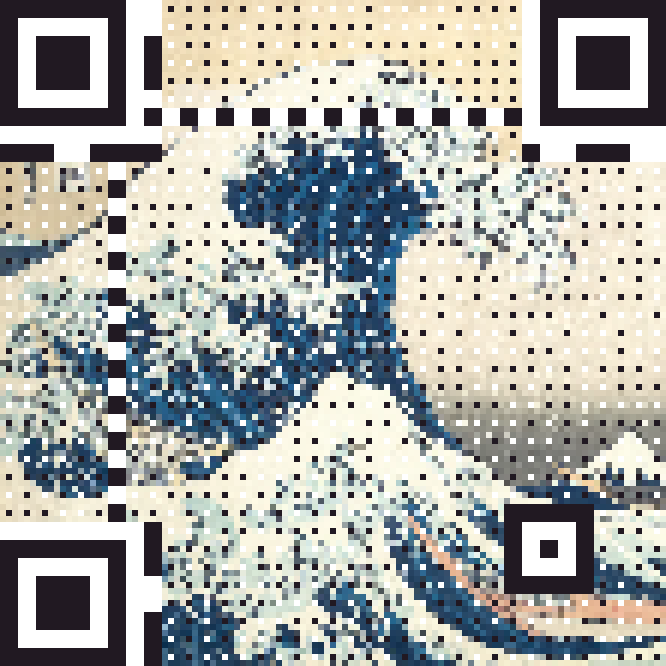<br/><sub>The Great Wave<br/><i>Hokusai</i></sub></td>
    <td align="center">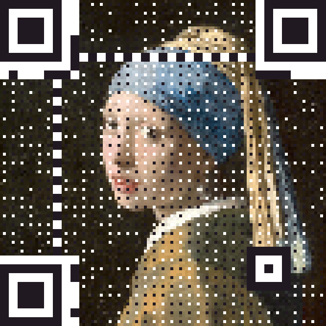<br/><sub>Girl with a Pearl Earring<br/><i>Vermeer</i></sub></td>
  </tr>
  <tr>
    <td align="center">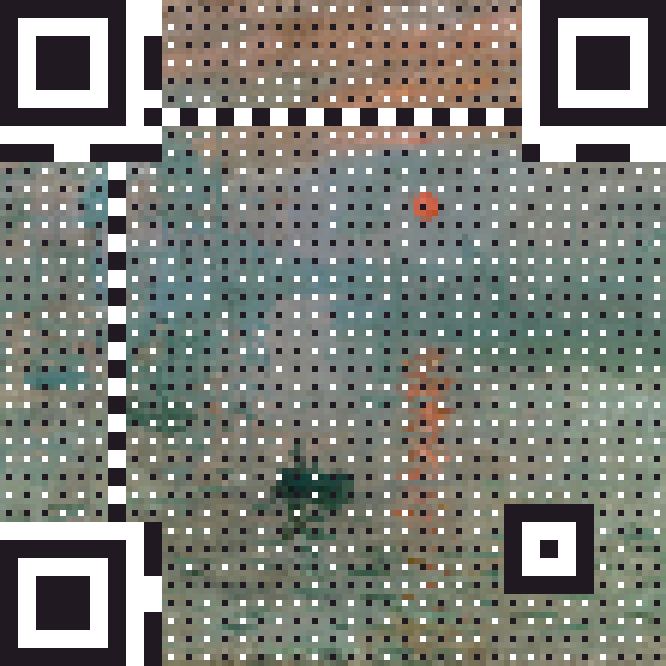<br/><sub>Impression, Sunrise<br/><i>Monet</i></sub></td>
    <td align="center">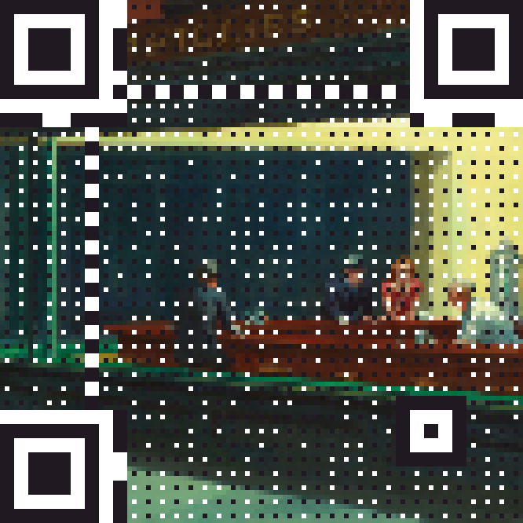<br/><sub>Nighthawks<br/><i>Hopper</i></sub></td>
    <td align="center">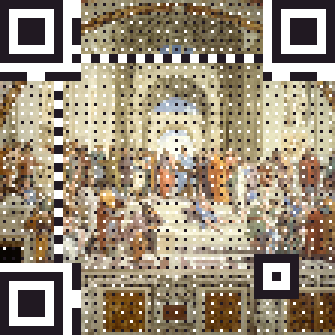<br/><sub>The School of Athens<br/><i>Raphael</i></sub></td>
  </tr>
</table>

<details>
<summary>+ 9 more art templates</summary>

Vermeer's <i>The Astronomer</i>, Monet's <i>Water Lilies</i> and <i>Woman with a Parasol</i>, Da Vinci's <i>The Last Supper</i>, Rembrandt's <i>The Night Watch</i>, Delacroix's <i>Liberty Leading the People</i>, Canaletto's <i>Grand Canal, Venice</i>, Caillebotte's <i>Young Man at His Window</i>, and Degas's <i>Visit to a Museum</i>. Full registry in [`src/templates/presets.ts`](src/templates/presets.ts).

</details>

### Highlights

- 21 built-in templates across two tabs — **Astronomy** (6 silhouettes) and **Art** (15 public-domain paintings) — plus upload your own PNG/SVG (≤ 10 MB)
- User-facing **color / mono** toggle: color mode samples ink per-pixel from the source; mono mode uses the template's accent colour with luminosity-clamped data modules. Sensible per-template default (astronomy → mono, art → color), overridable via the in-app toggle
- Decode an existing QR image and re-stylise it with a new template
- Adjustable silhouette scale + optional print-size scan check
- Live in-browser scan check (jsqr) at screen size and optional 200×200 print size
- Three exports: QR-only PNG, QR-only SVG (PNG-embedded wrapper), Poster PNG (1080², 1080×1920, A4, custom)
- 100% client-side. No backend. No tracking.

## Two render styles

The same URL, the same silhouette, two pipelines. Composite is sharper and scans more reliably; Halftone is the canonical Chu et al. 2013 look.

<table>
  <tr>
    <td align="center"><br/><sub><b>Composite</b> — default</sub></td>
    <td align="center">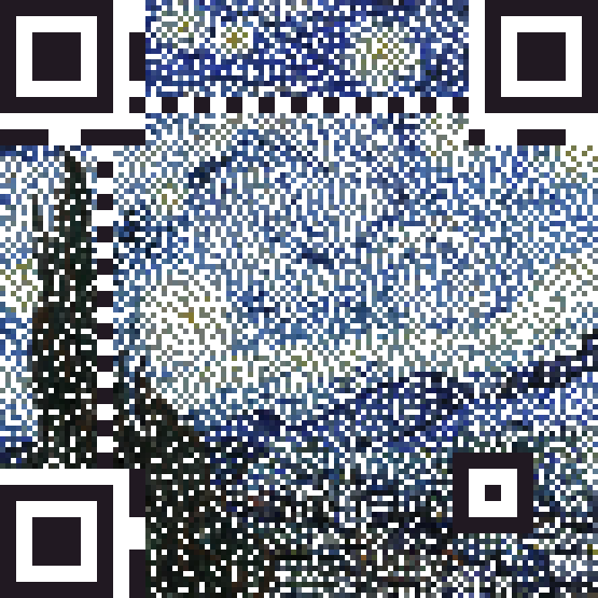<br/><sub><b>Halftone</b> — Chu et al. 2013</sub></td>
  </tr>
</table>

|  | Composite | Halftone |
|---|---|---|
| Look | QR-forward, image as frame | Image-forward, QR woven through |
| Scan reliability | High | Medium — depends on contrast |
| Best for | Posters with branding | Photographic / artistic prints |

## How it works

Canonical Chu et al. 2013 ("Halftone QR Codes", SIGGRAPH Asia) pipeline, extended with a Composite render mode (Cox/qart.js style), Sampling-Sim scoring (ArtCoder, CVPR 2021), and a probabilistic ART-UP flip budget.

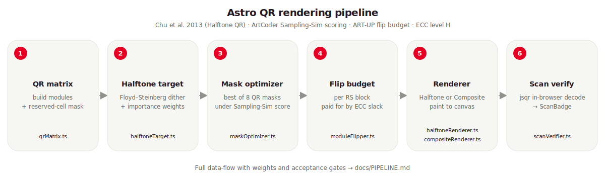

For the full data-flow with weights and acceptance gates, see [`docs/PIPELINE.md`](docs/PIPELINE.md).

## Try it locally

The fastest way to see what it does is [custom-qr.ntuas.com](https://custom-qr.ntuas.com). To run locally:

```bash
npm install
npm run dev               # vite dev server on :5173
npm test                  # vitest run (238 tests across 27 files)
npm run test:coverage     # vitest with coverage (CI gates: 80% lines, 70% branches)
npm run test:e2e          # playwright chromium + webkit (26 tests, builds first)
npm run typecheck         # tsc -b --noEmit
npm run lint              # eslint . --max-warnings=0
npm run build             # → dist/

# Dev-only — re-run when jsqr or rendering pipeline changes materially:
npm run calibrate:flip-budget  # tsx scripts/calibrate-flip-budget.ts
```

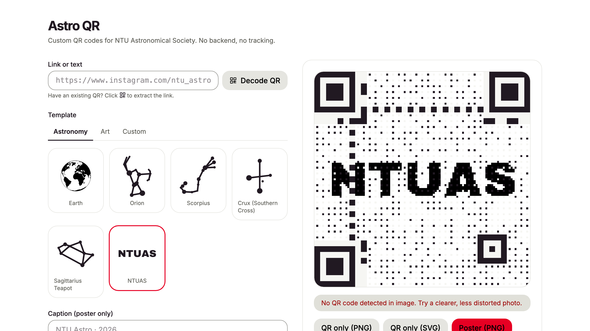

### Decode & re-stylise

Drop in any existing QR image and the app will decode it back to its URL/text, then let you re-render it with a new template.


## CI & Deploy

> **Note:** Branch protection is **not** currently enforced. See [`docs/FOLLOWUPS.md`](docs/FOLLOWUPS.md) for the manual repo-settings step needed to require these checks before merge.

GitHub Actions (`.github/workflows/ci.yml`) runs **all six gates** on every push and pull request:

1. `npm run typecheck` (tsc --noEmit)
2. `npm run lint` (eslint, zero warnings)
3. `npm run test:coverage` (vitest with 80%/70% thresholds)
4. `npm run build`
5. **Bundle-size budget** — gzipped JS must stay under 350 KB (currently ~127 KB)
6. `npm run test:e2e` (Playwright chromium + webkit)

A green `main` reflects all six.

Deployed as a Cloudflare Worker with [static assets](https://developers.cloudflare.com/workers/static-assets/) (`assets.directory` in [`wrangler.jsonc`](wrangler.jsonc), SPA fallback). Cloudflare Workers Builds auto-deploys from `main` via the GitHub integration (configured in the dashboard, not in this repo). For one-off manual deploys:

```bash
npx wrangler login        # one-time
npm run build
npm run deploy            # wrangler deploy
```

| Type | URL |
|---|---|
| Custom domain (primary) | [custom-qr.ntuas.com](https://custom-qr.ntuas.com) |
| `workers.dev` | [custom-qr.ntuas.workers.dev](https://custom-qr.ntuas.workers.dev) |
| Preview URLs | `*-custom-qr.ntuas.workers.dev` (per Workers Build) |

### Asset prep

Two NTU templates ship as best-effort placeholders. Maintainers can regenerate them from updated source logos — see [`public/templates/README.md`](public/templates/README.md).

## Project layout

```
src/
  App.tsx                  # state + pipeline orchestration
  appReducer.ts            # state machine (URL, template, advanced settings, renderMode)
  hooks/useQrPipeline.ts   # async pipeline orchestration hook
  index.css                # Tailwind v4 entrypoint + @theme tokens
  main.tsx                 # React root + ErrorBoundary
  types.ts                 # shared types (FilterMode, RenderMode, QRMatrix, RenderOptions, …)
  components/              # React UI (Controls, QrPreview, AdvancedOptions, etc.)
  lib/                     # pure pipeline modules
  templates/presets.ts     # template registry (id → asset + palette)
public/templates/          # built-in silhouette source assets (svg/png)
scripts/                   # dev-only tooling (calibrate-flip-budget.ts)
e2e/                       # Playwright smoke + flow tests (chromium + webkit)
docs/                      # PIPELINE.md, FOLLOWUPS.md, images/, superpowers/{plans,specs}
.github/workflows/ci.yml   # CI pipeline
```

See [`CLAUDE.md`](CLAUDE.md) if you're a Claude Code agent landing in this repo, [`docs/PIPELINE.md`](docs/PIPELINE.md) for the canonical pipeline data-flow reference, [`docs/FOLLOWUPS.md`](docs/FOLLOWUPS.md) for tracked-but-deferred work, and [`CONTRIBUTING.md`](CONTRIBUTING.md) for the human contributor flow.

## Architecture & references

Canonical Chu et al. 2013 ("Halftone QR Codes", SIGGRAPH Asia) pipeline, extended in 2026-05 with composite render mode (Cox/qart.js style), Sampling-Sim scoring (ArtCoder, CVPR 2021), and probabilistic ART-UP flip budget. See [`docs/PIPELINE.md`](docs/PIPELINE.md) for the full data-flow diagram.

**Pipeline modules** (`src/lib/*`):

- `qrMatrix.ts` — QR module matrix build + reserved-cell mask
- `imageOps.ts` — pure canvas/image-data helpers + shared image-conditioning (rasterise, Floyd–Steinberg dither, lift margin, blend against white, silhouette detection, luminosity clamp, structural-ink constants)
- `halftoneTarget.ts` — Stage 1: dither the source to per-module targets + importance weights
- `predictedCanvas.ts` — Stage 2 prep: subpixel-resolution canvas built once per pipeline run; consumed by both renderers and Sampling-Sim
- `maskOptimizer.ts` — Stage 2: pick the QR mask whose post-mask matrix best matches the target under Sampling-Sim scoring
- `codewordLayout.ts` — module ↔ codeword inverse map for ECC-H symbols (used by Stage 3 to budget flips per RS block)
- `samplingSim.ts` — ArtCoder-style Gaussian-weighted readback model (5×5 subpixel kernel, σ=1) used by mask scoring + flip Δ-scoring
- `flipBudget.ts` + `flipBudget.calibration.ts` — Stage 3 acceptance gate; `'fixed'` (Phase 2 default) or `'probabilistic'` (ART-UP, activates when calibration AUC > 0.85)
- `moduleFlipper.ts` — Stage 3a: per-RS-block greedy flips with lazy re-score, paid for by ECC slack (default budget 0.15 × ecCount under `'fixed'`)
- `halftoneRenderer.ts` — Chu et al. 2013 sub-pixel halftone (3×3 grid per module, centre 1/9 stamp); diffuses image across all modules
- `compositeRenderer.ts` — qart.js-style composite (centre 1/9 = QR data, surround 8/9 = cover image); reserved cells always paint structural ink for decode contrast
- `composer.ts` — poster layout (separate from QR rendering itself)
- `scanVerifier.ts` — jsqr-based in-browser scan check at multiple sizes
- `decodeQrImage.ts` — decode an uploaded QR image back to its URL/text (the "Decode QR" button feature)

**Other src/ surfaces:**

- `src/templates/presets.ts` — template registry
- `src/components/*` — React UI (`AdvancedOptions.tsx` carries the new render-style radio)
- `src/App.tsx` + `src/appReducer.ts` — state + pipeline orchestration
- `src/hooks/useQrPipeline.ts` — orchestrates the pipeline; rebuilds on `[url, templateId, customSource, silhouetteScale, multiSize, filter, renderMode]`

**Calibration tooling** (`scripts/calibrate-flip-budget.ts`): generates a 120-QR corpus, fits logistic regression on per-flipped-module features, writes `src/lib/flipBudget.calibration.ts`. Re-run when jsqr is upgraded or the rendering pipeline changes meaningfully.

QRs are checked live in the browser via the jsqr scan verifier (`scanVerifier.ts`), which feeds the on-screen ScanBadge. Note that jsqr is stricter than real phone cameras — canonical halftone QRs intentionally have no quiet zone, which can trip pure-JS decoders even when phones decode fine, so the "may not scan" warning is conservative.

**References:**

- Chu, H.-K. et al. *Halftone QR Codes*. SIGGRAPH Asia 2013.
- Su, M. et al. *ArtCoder: An End-to-End Method for Generating Scanning-Robust Stylized QR Codes*. CVPR 2021. (Sampling-Sim scoring.)
- Cox, R. *QArt Codes*. (Composite-style technique.)

## License

Internal NTU Astronomical Society project. Logo assets © NTU Astronomical Society.
